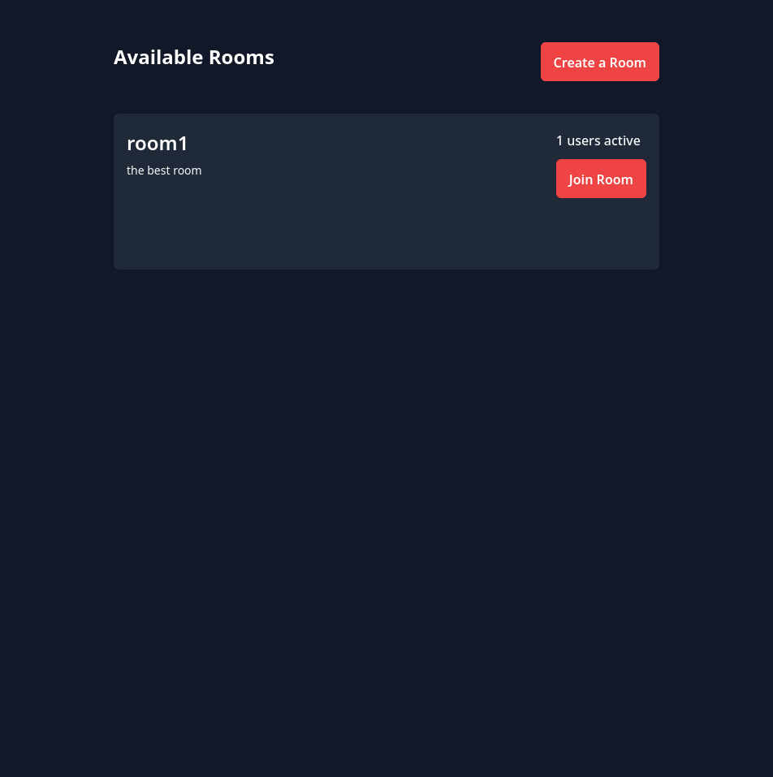
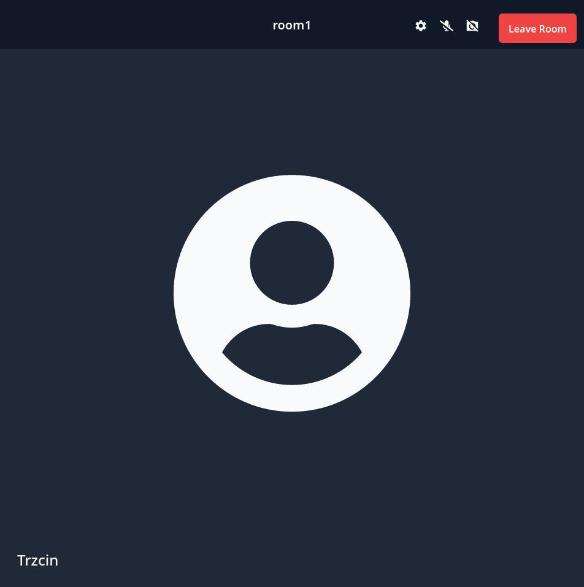
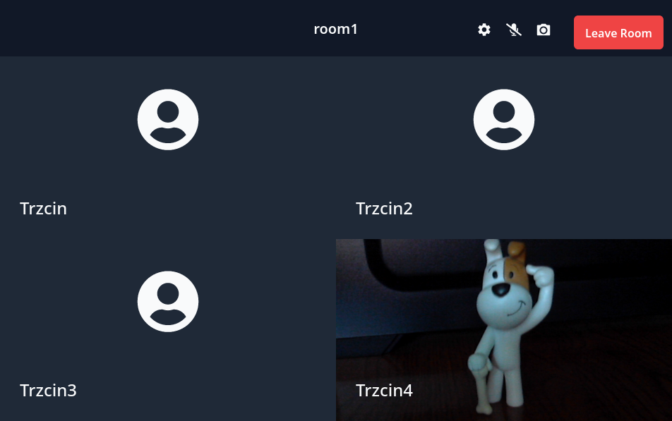

# WebRTC VideoChat

Web app meant for audio and video calls. Allows users to create rooms, which others can find through the room browser. Built with React, Peer.js, Prisma and Tailwind css.

## Examples





## Running

### Server

```
cd server
npm install
# create sqlite database
npx prisma migrate dev
npm run dev
```

### Frontend

```
cd frontend
npm install
npm run dev
```
